<h1 align="center">NetSecure Pro</h1>

<p align="center">
  Intelligent desktop application for local network supervision, security analysis, reporting, and AI-assisted operational guidance.
</p>

<p align="center">
  
  
  
  
  
</p>

## Table of Contents

- [Overview](#overview)
- [Project Highlights](#project-highlights)
- [Core Capabilities](#core-capabilities)
- [Interface Preview](#interface-preview)
- [Architecture](#architecture)
- [Technology Stack](#technology-stack)
- [Getting Started](#getting-started)
- [Project Structure](#project-structure)
- [AI Security Copilot](#ai-security-copilot)
- [PDF Reporting](#pdf-reporting)
- [Roadmap / Future Improvements](#roadmap--future-improvements)
- [Operational Notes](#operational-notes)
- [License](#license)

## Overview

NetSecure Pro is a Python desktop application designed to centralize the essential tasks of local network supervision and basic security assessment. From a single interface, an administrator can discover active hosts, inspect open services, monitor traffic, review alerts, calculate a network security score, generate professional PDF reports, and query an AI copilot for remediation guidance.

## Project Highlights

<table>
  <tr>
    <td width="25%" valign="top">
      <strong>Unified Security Workspace</strong><br/>
      Hosts, ports, alerts, monitoring, AI guidance, and reporting are available from one desktop application.
    </td>
    <td width="25%" valign="top">
      <strong>Actionable Visibility</strong><br/>
      The project goes beyond display-only dashboards by connecting discovery, exposure review, scoring, and recommendations.
    </td>
    <td width="25%" valign="top">
      <strong>Professional Output</strong><br/>
      PDF reports, CSV exports, event logs, and scan history make the application useful for both demonstration and operational review.
    </td>
    <td width="25%" valign="top">
      <strong>AI-Assisted Guidance</strong><br/>
      The integrated copilot supports both general cybersecurity questions and scan-aware remediation prompts.
    </td>
  </tr>
</table>

## Core Capabilities

### Network Discovery

- Discover active hosts through `Ping`, `ARP`, and TCP fallback methods
- Enrich hosts with IP, MAC address, hostname, vendor, device type, and OS guess
- Filter and search discovered assets directly from the interface

### Port and Service Analysis

- Run multi-mode TCP scans (`Quick`, `Common`, `Extended`, `Custom`)
- Detect exposed services and classify their risk level
- Capture basic service banners for better context during analysis

### Monitoring and Security Analysis

- Track live bandwidth and interface activity
- Generate alerts from operational and security signals
- Produce a rule-based security score with observations and recommendations
- Review scan history and event logs for traceability

### Reporting and AI Assistance

- Export a professional PDF security report
- Export selected datasets to CSV
- Use the AI Security Copilot in `General Chat` and `Scan-Aware Chat` modes
- Store the OpenRouter model and API key from the application settings

## Interface Preview

<table>
  <tr>
    <td align="center"><strong>Dashboard</strong><br/>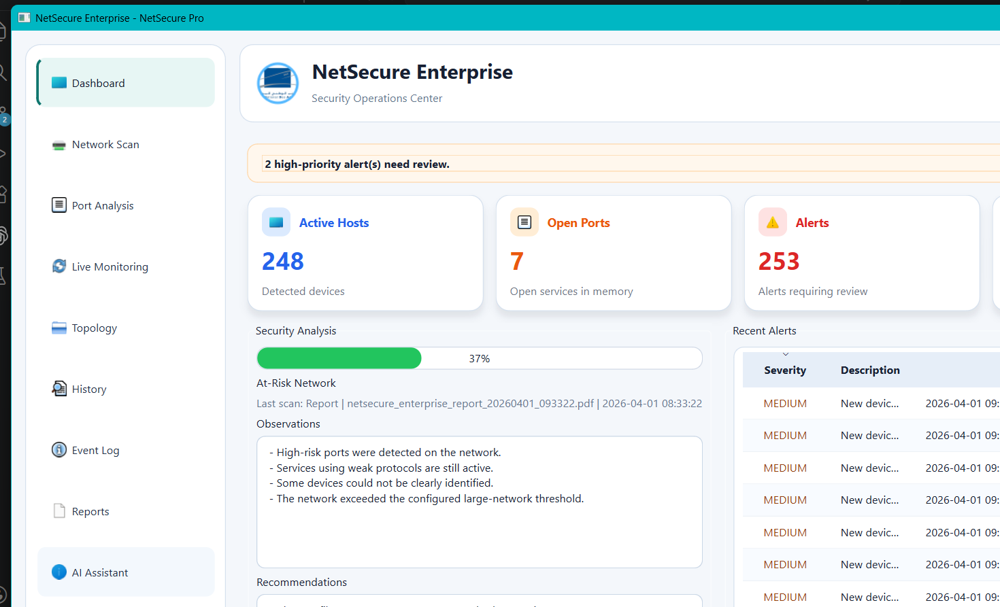</td>
    <td align="center"><strong>Network Scan</strong><br/>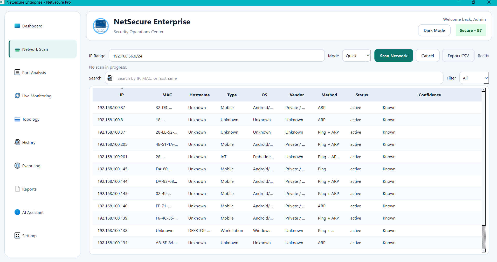</td>
  </tr>
  <tr>
    <td align="center"><strong>Port Analysis</strong><br/>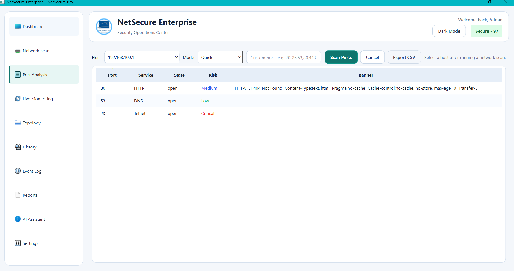</td>
    <td align="center"><strong>Live Monitoring</strong><br/>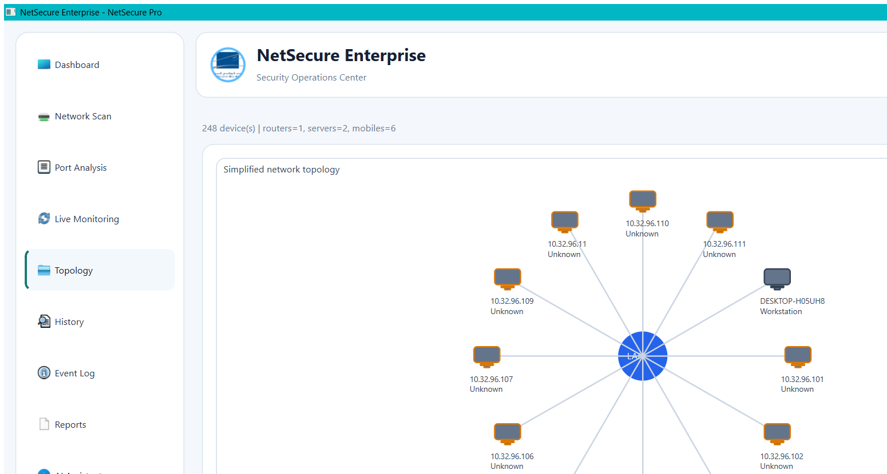</td>
  </tr>
  <tr>
    <td align="center"><strong>Topology</strong><br/>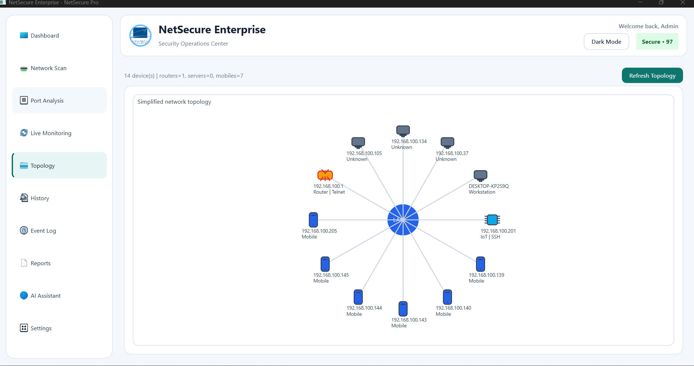</td>
    <td align="center"><strong>AI Assistant</strong><br/>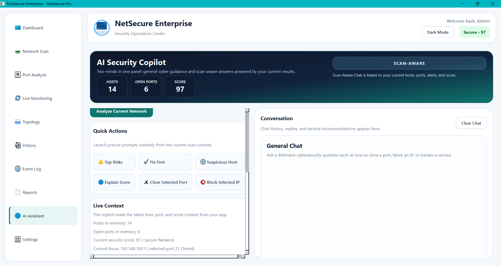</td>
  </tr>
</table>

<details>
  <summary><strong>Additional Screens</strong></summary>
  <br/>

  <table>
    <tr>
      <td align="center"><strong>History</strong><br/>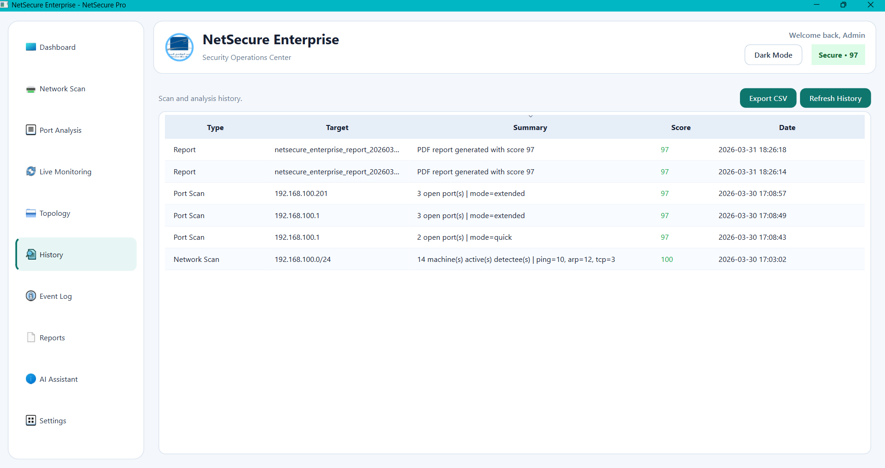</td>
      <td align="center"><strong>Event Log</strong><br/>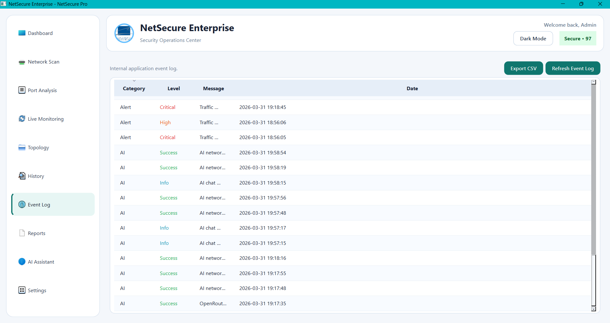</td>
    </tr>
    <tr>
      <td align="center"><strong>Reports</strong><br/>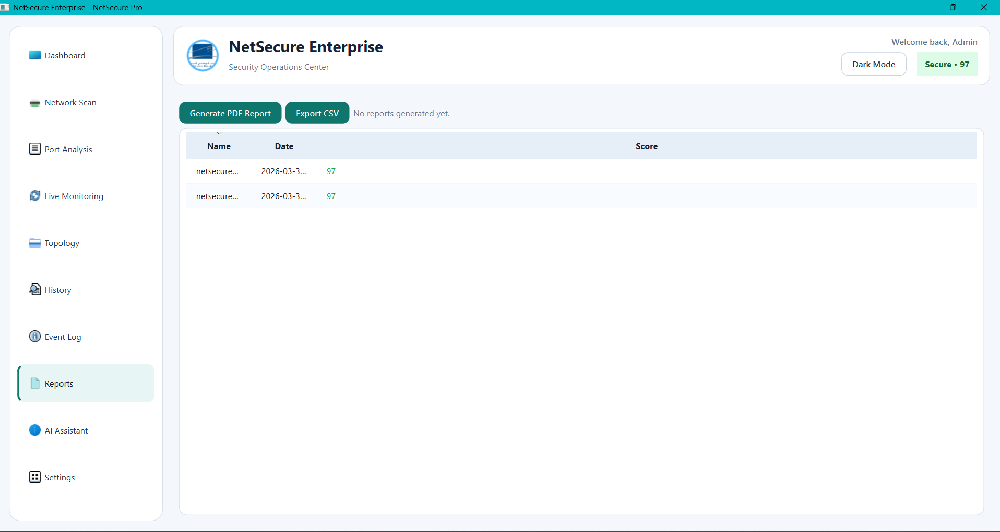</td>
      <td align="center"><strong>Settings</strong><br/>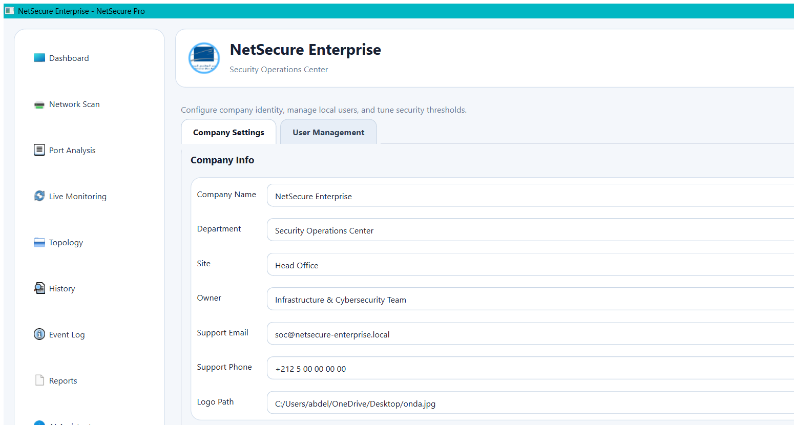</td>
    </tr>
    <tr>
      <td align="center"><strong>User Management</strong><br/>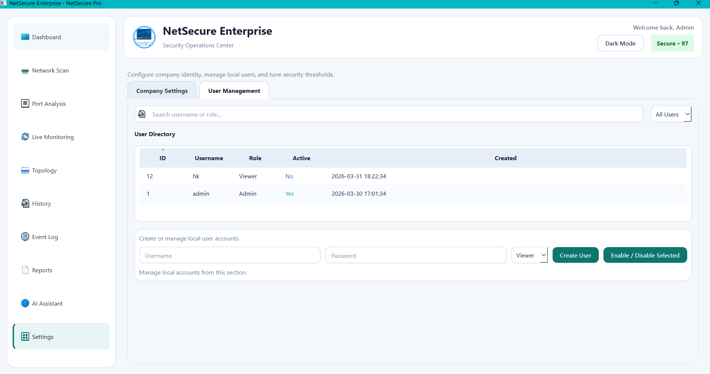</td>
      <td align="center"><strong>Security Workflow</strong><br/>Asset discovery, port review, monitoring, AI analysis, and reporting are all accessible from the same desktop workspace.</td>
    </tr>
  </table>

</details>

## Architecture

- **Presentation Layer**: PyQt6 windows, forms, tables, cards, charts, and navigation
- **Core Services**: authentication, discovery, port scanning, monitoring, scoring, alerts, and reporting
- **Persistence Layer**: SQLite storage for users, settings, devices, alerts, reports, and history
- **AI Layer**: OpenRouter-backed assistant for operational guidance and scan-aware questions

## Technology Stack

- `Python 3.10+`
- `PyQt6`
- `SQLite`
- `psutil`
- `OpenRouter API`

## Getting Started

### 1. Install dependencies

```powershell
python -m pip install -r requirements.txt
```

### 2. Launch the application

```powershell
python main.py
```

### 3. Sign in with the default demo account

- Username: `admin`
- Password: `admin123`

## Project Structure

```text
main.py
netsecure_pro/
  app.py
  auth.py
  database.py
  network.py
  ports.py
  monitor.py
  security.py
  reporting.py
  ai_assistant.py
  ui.py
assets/screenshots/
README.md
requirements.txt
```

## AI Security Copilot

The application includes an integrated AI assistant with two operating modes:

- **General Chat**: ask defensive cybersecurity questions such as how to close a port, block an IP, or harden a service
- **Scan-Aware Chat**: ask questions that rely on the latest discovered hosts, open ports, alerts, and security score

## PDF Reporting

The built-in reporting engine generates a professional PDF document that summarizes:

- organization identity
- detected assets
- exposed services
- recent alerts
- security posture and recommendations

## Roadmap / Future Improvements

### Security Intelligence

- Add richer anomaly detection workflows with AI-assisted prioritization
- Improve service fingerprinting and host classification accuracy
- Extend risk scoring with more contextual decision rules

### Visibility and Reporting

- Expand report export options with richer visual summaries and charts
- Introduce comparison between historical scans and current posture
- Add clearer longitudinal views for alerts, hosts, and exposure trends

### Administration and Access Control

- Add stronger multi-user administration and permission controls
- Improve credential management and operational hardening for production-style usage
- Refine settings management for larger environments and repeated scans

### Platform Evolution

- Extend topology and asset relationships with smarter grouping and context
- Prepare the project for broader integration scenarios and future extensibility
- Explore packaging and deployment improvements for easier distribution

## Operational Notes

- Network discovery depends on local permissions, ICMP behavior, and ARP visibility on the target environment.
- The application creates `netsecure_pro.db` on first launch to store users, settings, alerts, reports, and scan history.
- Generated reports and CSV exports stay local and are ignored by Git by default.
- The default credentials are intended for demonstration and should be changed in real deployments.

## License

This project is licensed under the MIT License. See the [LICENSE](LICENSE) file for details.
